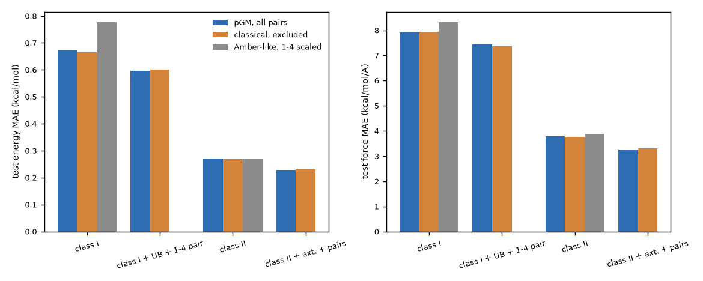
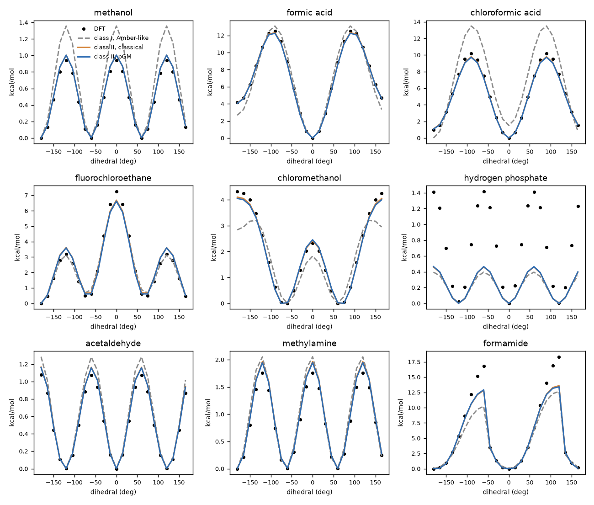
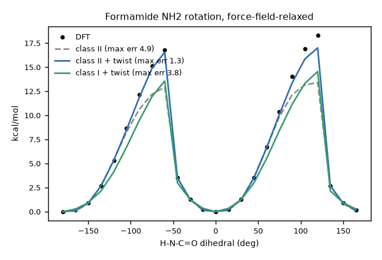
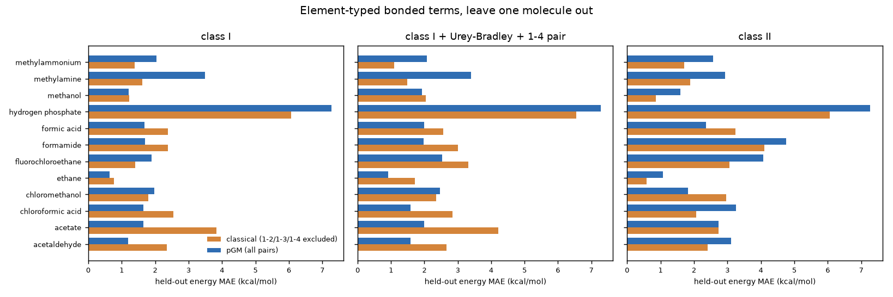
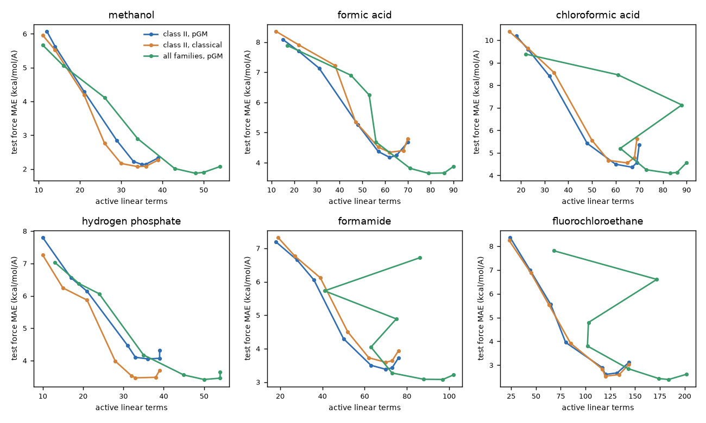
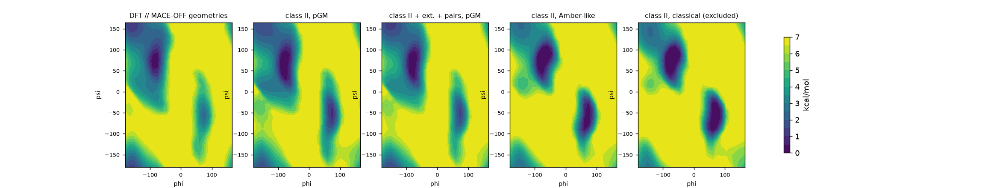

# Bonded terms for flexible pGM molecules: first study

2026-09-24, pGM-JAX `pgm_jax/bonded` (9-hour job). Reference data: DFT wB97M-D3(BJ)/def2-TZVPPD
energies, forces and dipoles on MACE-OFF-sampled geometries. Question: pGM has no 1-2/1-3/1-4
exclusions (Gaussian-screened charges and covalent-bond dipoles, induction between all pairs), so
what should its bonded terms look like, and does the physical intramolecular electrostatics make
them simpler or more transferable? Baseline: the bonded-only 1-4 treatment of Abdullah et al.
(arXiv 2504.14398; class II couplings fitted to QM energies and forces).

## Summary

- **Per molecule, the bonded functional form sets the accuracy and absorbs any consistent
  electrostatics.** Class II couplings halve the class I errors (energy 0.27 vs 0.67 kcal/mol,
  force 3.8 vs 7.9 kcal/mol/A, 12 flexible molecules; extended couplings + pair terms 0.23 / 3.3).
  pGM (all pairs), full 1-2/1-3/1-4 exclusion and Amber-like 1-4 scaling give the same class II
  accuracy on the small flexible and rigid molecules; with class I terms, Amber-like scaling is
  worse on the strongly Coulombic ones (the paper's observation).
- **Coupled conformational surfaces need pGM's all-pair electrostatics.** On the alanine dipeptide
  phi/psi surface pGM reaches 0.77 kcal/mol (0.50 with extended couplings and pair terms) on the
  held-out half of the grid; with the 1-2/1-3/1-4 pairs excluded the error is 2.5-3.0 kcal/mol and
  with Amber-like scaling 1.9-2.5, for every bonded form tried (maximum errors 8-15 kcal/mol). The
  gain comes from the induction couplings between bonded neighbours, not from the permanent 1-2/1-3
  energies; trained on MD only, pGM extrapolates to the surface far better (2.5 vs 4.6-8.9).
- **A new bonded term: the twist of 3-coordinated centres (F9).** A Fourier term in the
  Winkler-Dunitz twist angle of amide, carbonyl and amine centres fixes the formamide amide
  rotation (relaxed-scan error 4.9 -> 1.3 kcal/mol; mean over 12 molecules 0.73 -> 0.43); a torsion
  x out-of-plane coupling does not.
- **pGM gives dipoles and transferable simple bonded terms.** Molecular dipoles along the MD: 0.33 D
  RMSE for pGM vs 1.4-1.7 D for the exclusion schemes (0.23 D with charge/covalent-dipole flux).
  With element-typed class I terms fitted on 11 molecules, held-out carbonyl and carboxyl molecules
  are 42 % better with pGM (1.57 vs 2.70 kcal/mol); amines, ammonium and phosphate transfer worse
  (4.27 vs 3.03), because their ESP charges on N and P are large and molecule-specific.
- **Learned electrostatic corrections do not transfer.** Learned 1-2/1-3/1-4 scale factors (F10)
  collapse in transfer (8.1 kcal/mol). Charges fitted with the bonded terms (F11) halve the in-sample
  errors (1.41 -> 0.77 kcal/mol) at the cost of the ESP (1.5 -> 2.5-7 mhartree/e), and in transfer
  trade gains on amines and phosphate for losses on carbonyls (2.33-2.99 vs 2.20 kcal/mol overall).
- **Electronic-structure-inspired terms (F12).** Hybrid-orbital angles (Bent's rule, one sp^m
  index per centre-substituent type) are the most transferable angle term found (held-out 2.20 ->
  1.97 kcal/mol with pGM, 2.32 -> 1.65 with the classical control); torsions can be replaced by pi
  conjugation + hyperconjugation + signed volume at equal per-molecule accuracy, but without better
  transfer.
- **Robustness.** The fitted force fields, class II included, run stably in gas-phase MD (240
  replicas x 20 ps at 298 and 500 K). pGM does not need fewer coupling terms (identical L1 paths),
  and many class II parameters with generic typing overfit the electrostatic compensation (pGM
  worse in transfer, 3.13 vs 2.64 kcal/mol).

## Setup

| Item | Choice |
| --- | --- |
| Molecules | 17 small molecules after the paper's Fig. 1: A1 flexible (ethane, methanol, methylamine, methanethiol, acetaldehyde, formic acid, formamide, 1-fluoro-2-chloroethane), A2 strong Coulombic 1-4 (chloroformic acid, chloromethanol), A3 charged (acetate, methylammonium, hydrogen phosphate), A4 rigid (ethene, benzene, pyridine, cyclopentane); B alanine dipeptide |
| Sampling | MACE-OFF23 (medium) in the role of the paper's xTB: Langevin MD, 200 frames at 500 K (training) and 400 at 298 K (test), split over the conformers; relaxed torsion scans every 15 degrees; dipeptide phi/psi grid every 15 degrees (576 constrained minimisations) |
| Labels | psi4 wB97M-D3(BJ)/def2-TZVPPD energy, gradient and dipole for every frame (the level of MACE-OFF's training data); no MACE-OFF labels are used |
| pGM electrostatics | GAFF types; B3LYP/aug-cc-pVTZ ESP at the MACE-OFF minimum; two-stage py_resp (pGM-perm, all pairs); pGM-pol polarisabilities and radii; GAFF LJ from 1-5 on |
| Model | E = bonded(families) + pGM (all pairs, induced dipoles) + LJ(1-5+); controls: `elec_exclude=3` (1-2/1-3/1-4 removed from permanent and induced electrostatics), Amber-like (`elec_exclude=2`, 1-4 electrostatics x 1/1.2, 1-4 LJ x 0.5) |
| Fit | energies (per-molecule offset removed) and forces of the 500 K frames and the relaxed scans, weights 1 kcal/mol and 1 kcal/mol/A; L-BFGS on all bonded parameters including reference values (pGM exerts intramolecular forces at the minimum, so they cannot be the QM minimum) |
| Metrics | the paper's: test energy MAE and mean force-error norm per atom on the 298 K frames; torsion scans relaxed at force-field level (local relaxation, +-0.3 A box), maximum profile error |

Methanethiol is excluded from all means: its py_resp fit does not reproduce the ESP (relative
RMSE 0.70; molecular dipole off by 0.7 D), a pGM-pol/py_resp issue for sulfur to follow up.

## Bonded form x electrostatics (per-molecule fits, 12 molecules)



<!-- TABLE_MAIN -->
| Bonded form | Electrostatics | Energy MAE (kcal/mol) | Force MAE (kcal/mol/A) | Relaxed-scan max error (kcal/mol) | Dipole RMSE (D) | Parameters per molecule |
| --- | --- | --- | --- | --- | --- | --- |
| class I (diag) | pGM, all pairs | 0.67 | 7.9 | 1.53 | 0.33 | 23 |
| class I (diag) | classical, 1-2/1-3/1-4 excluded | 0.66 | 7.9 | 1.48 | 1.68 | 23 |
| class I (diag) | Amber-like, 1-4 scaled | 0.78 | 8.3 | 1.70 | 1.43 | 23 |
| class II (paper) | pGM, all pairs | 0.27 | 3.8 | 0.73 | 0.33 | 74 |
| class II (paper) | classical, 1-2/1-3/1-4 excluded | 0.27 | 3.8 | 0.69 | 1.68 | 74 |
| class II (paper) | Amber-like, 1-4 scaled | 0.27 | 3.9 | 0.70 | 1.43 | 74 |
| class I + Urey-Bradley + 1-4 pair (F2) | pGM, all pairs | 0.60 | 7.4 | 1.20 | 0.33 | 36 |
| class I + Urey-Bradley + 1-4 pair (F2) | classical, 1-2/1-3/1-4 excluded | 0.60 | 7.4 | 1.17 | 1.68 | 36 |
| class II + extended couplings + pairs | pGM, all pairs | 0.23 | 3.3 | 0.61 | 0.33 | 105 |
| class II + extended couplings + pairs | classical, 1-2/1-3/1-4 excluded | 0.23 | 3.3 | 0.67 | 1.68 | 105 |
| class I + twist (F9) | pGM, all pairs | 0.67 | 7.9 | 1.31 | 0.33 | 25 |
| class I + twist (F9) | classical, 1-2/1-3/1-4 excluded | 0.66 | 7.9 | 1.25 | 1.68 | 25 |
| class II + twist (F9) | pGM, all pairs | 0.27 | 3.8 | 0.43 | 0.33 | 76 |
| class II + twist (F9) | classical, 1-2/1-3/1-4 excluded | 0.27 | 3.8 | 0.41 | 1.68 | 76 |
| F3 torsion_mod (factorised) | pGM, all pairs | 0.35 | 4.2 | 1.07 | 0.33 | 46 |
| class II + 1-4 pair | pGM, all pairs | 0.26 | 3.7 | 0.67 | 0.33 | 79 |
| class II + charge/CBV flux (F6) | pGM, all pairs | 0.26 | 3.4 | 0.72 | 0.23 | 81 |
| class I + charge/CBV flux (F6) | pGM, all pairs | 0.66 | 7.7 | 1.09 | 0.32 | 30 |
| all + charge/CBV flux | pGM, all pairs | 0.22 | 3.0 | 0.63 | 0.23 | 112 |
| class I + learned 1-2/1-3/1-4 pair scales (F10) | pGM, all pairs | 0.56 | 6.5 | 1.27 | 0.33 | 32 |
| class II + learned 1-2/1-3/1-4 pair scales (F10) | pGM, all pairs | 0.24 | 2.9 | 0.73 | 0.33 | 83 |
<!-- /TABLE_MAIN -->

Torsion profiles (DFT at MACE-OFF-relaxed geometries vs force-field-relaxed):



## A new term: twist of 3-coordinated centres (F9)

Every form in the paper's family misses formamide's NH2 rotation barrier (DFT 16.8-18.3 kcal/mol)
by 4-6 kcal/mol, even at the DFT geometries (single points 13.5-14 kcal/mol), although the scan is
in the training data. At the barrier the nitrogen is strongly pyramidal (the three angles at N sum
to 320 deg instead of 360): both N-H bonds fold to the oxygen side, with H-N-C=O dihedrals of +60 and
-54 deg instead of +-90 deg. A separable (1 + cos 2 phi) term then sits at three quarters of its
maximum, although the lone pair is fully out of conjugation. The resonance that the barrier breaks
depends on where the nitrogen lone pair points, not on the individual substituents.

The twist term (`twist`, `pgm_jax/bonded/terms.py`) uses the Winkler-Dunitz twist angle of a
3-coordinated centre k about the bond j-k, built from the two dihedrals i-j-k-l1 and i-j-k-l2:
tau = arg(e^(i phi1) - e^(i phi2)), E = sum_n K_n (1 + cos n tau). For a planar centre tau equals
phi1; for a symmetrically pyramidalised one it stays at the lone-pair angle while the dihedrals
move (`tests/test_bonded.py::test_twist_angle`). It applies to every amide, carbonyl, carboxyl and
amine centre, including phi and psi of peptides.



| Formamide NH2 rotation, max error of the relaxed profile (kcal/mol) | pGM | classical |
| --- | --- | --- |
| class I | 6.35 | 6.44 |
| class I + twist | 3.78 | 3.75 |
| class II | 4.93 | 4.74 |
| class II + twist | 1.33 | 1.33 |

The other molecules' test energy errors move by less than 0.01 kcal/mol. A torsion x
out-of-plane coupling (`torsion_oop`, K cos 2 phi sum sin^2 improper, F8), the obvious alternative,
does nothing (4.93 -> 5.09).

## Stability in MD

Fitted force fields (bonded + pGM + LJ) in gas-phase Langevin MD (`scripts/bonded/md_check.py`,
BAOAB, 0.5 fs, 20 ps, 4 replicas per molecule, jax):

<!-- TABLE_MD -->
| Force field | T (K) | Stable replicas | Bond fluctuation / MACE | Angle fluctuation / MACE | Torsion histogram L1 |
| --- | --- | --- | --- | --- | --- |
| class II, pGM | 298 | 48/48 | 0.75 | 0.74 | 0.29 |
| class II, pGM | 500 | 48/48 | 0.95 | 0.95 | 0.16 |
| class II, classical | 500 | 48/48 | 0.95 | 0.95 | 0.21 |
| class I, pGM | 500 | 48/48 | 0.98 | 1.01 | 0.19 |
| class II + ext. + pairs, pGM | 500 | 48/48 | 0.94 | 0.94 | 0.18 |

Median over molecules; fluctuations are standard deviations over the MD relative to the DFT-labelled MACE-OFF frames at the same temperature (298 K test, 500 K training).
<!-- /TABLE_MD -->

No replica of any molecule left its basin, class II cross terms included, so the unboundedness far
from equilibrium does not matter at 500 K on this time scale. At 500 K the bond and angle
fluctuations match the MACE-OFF 500 K frames; at 298 K they are about 25 % narrower than the MACE-OFF
298 K frames, which we have not explained (the DFT energies of the MACE-OFF frames sit 1.5-1.8 times
the equipartition value above the minimum at both temperatures, so the sampling surface and the
fitted one differ).

## Transfer: element-typed bonded terms, leave one molecule out

Bonded parameters tied by element only (bond C-H, angle H-C-O, ...), fitted jointly on 11
molecules, tested on the held-out one (298 K frames).



<!-- TABLE_LOO -->
| Bonded form (element-typed) | Held-out group | pGM, all pairs | classical, excluded | pGM without 1-2/1-3 |
| --- | --- | --- | --- | --- |
| class I | carbonyl/carboxyl | 1.57 / 22.4 | 2.70 / 31.8 | 3.03 / 31.3 |
| class I | amine/ammonium/phosphate | 4.27 / 44.7 | 3.03 / 29.4 | 3.71 / 28.2 |
| class I | other (alkane, alcohol, halides) | 1.43 / 13.0 | 1.30 / 12.9 | 1.79 / 14.6 |
| class I | all 12 | 2.20 / 24.9 | 2.32 / 24.9 | 2.79 / 25.0 |
| class I + Urey-Bradley + 1-4 pair | carbonyl/carboxyl | 1.83 / 25.1 | 3.06 / 34.6 |  |
| class I + Urey-Bradley + 1-4 pair | amine/ammonium/phosphate | 4.25 / 42.3 | 3.04 / 26.8 |  |
| class I + Urey-Bradley + 1-4 pair | other (alkane, alcohol, halides) | 1.96 / 18.8 | 2.35 / 21.0 |  |
| class I + Urey-Bradley + 1-4 pair | all 12 | 2.48 / 27.3 | 2.82 / 28.1 |  |
| class I + 1-4 pair | carbonyl/carboxyl | 1.82 / 23.5 | 2.85 / 32.6 |  |
| class I + 1-4 pair | amine/ammonium/phosphate | 4.35 / 45.1 | 3.21 / 29.4 |  |
| class I + 1-4 pair | other (alkane, alcohol, halides) | 1.75 / 13.5 | 1.47 / 13.0 |  |
| class I + 1-4 pair | all 12 | 2.43 / 25.6 | 2.48 / 25.3 |  |
| class II | carbonyl/carboxyl | 3.25 / 37.9 | 2.91 / 34.9 |  |
| class II | amine/ammonium/phosphate | 4.26 / 45.6 | 3.22 / 31.2 |  |
| class II | other (alkane, alcohol, halides) | 2.14 / 19.7 | 1.86 / 15.6 |  |
| class II | all 12 | 3.13 / 33.8 | 2.64 / 27.6 |  |

Energy MAE (kcal/mol) / force MAE (kcal/mol/A), means over the held-out molecules of each group.
<!-- /TABLE_LOO -->

Learned pair scales (F10, `--escale`): pGM plus a fitted scale kappa per element pair and
separation on the permanent 1-2/1-3/1-4 pair energies (kappa = -1 removes the pair, kappa = 0 is
pGM; `BondedSettings.escale`). Per molecule they act as extra fitting freedom (class I: 0.67 -> 0.56
kcal/mol, 7.9 -> 6.5 kcal/mol/A). In transfer they fail: held-out energy error 8.1 kcal/mol over the
12 molecules, 49 for acetate and 13 for chloroformic acid. The element-typed scales absorb
molecule-specific errors (fitted kappa -9.6 for the C...Cl 1-3 pair, +4.4 for the C-F bond) and the
pair energies they multiply are large. A learned 1-4 scale alone does not help either (2.37 vs 2.20
kcal/mol). The data do not ask for partial exclusions: the fixed, all-pairs pGM transfers best.

## Fitting the pGM charges as well (F11)

The transfer failures trace to the ESP charges, so we let the differentiable model fit them together
with the bonded terms, to DFT energies, forces and dipoles and optionally the QM ESP of each molecule
(`--wesp`, squared ESP RMSE in units of 2 mhartree/e). Two parametrisations, both shared across
molecules through atom environments (element + bonded neighbours):

- typed charges and covalent dipoles (`--qfit 1`), total charge kept by a uniform shift;
- typed bond-charge increments and covalent-dipole corrections added to each molecule's ESP values
  (`--qbci 1`), neutral by construction and equal to the ESP model at zero.

Fitted on all 12 molecules (element-typed class I bonded terms):

<!-- TABLE_QFIT -->
| Electrostatics (class I bonded terms, element-typed, fitted on all 12) | Energy MAE | Force MAE | Dipole RMSE (D) | ESP RMSE (mhartree/e) |
| --- | --- | --- | --- | --- |
| ESP charges per molecule (fixed) | 1.41 | 17.1 | 0.33 | 1.48 |
| typed charges, E/F/dipole fit | 0.79 | 8.7 | 0.26 | 6.50 |
| typed charges, E/F/dipole + ESP (w = 1) | 0.84 | 9.1 | 0.24 | 3.98 |
| typed charges, E/F/dipole + ESP (w = 10) | 0.95 | 10.0 | 0.22 | 2.51 |
| typed charges, E/F/dipole + ESP (w = 1000) | 1.35 | 15.0 | 0.35 | 1.55 |
| depth-2 typed charges, E/F/dipole + ESP (w = 1) | 0.82 | 8.9 | 0.23 | 3.68 |
| ESP charges + typed bond-charge increments, E/F/dipole | 0.77 | 8.6 | 0.24 | 7.09 |
| ESP charges + typed bond-charge increments, E/F/dipole + ESP (w = 1) | 0.79 | 8.8 | 0.22 | 4.02 |
| ESP charges + typed bond-charge increments, E/F/dipole + ESP (w = 10) | 0.88 | 9.5 | 0.21 | 2.56 |

kcal/mol, kcal/mol/A; 298 K frames. ESP: B3LYP/aug-cc-pVTZ potential at the MACE-OFF minimum (800 points per molecule; the per-molecule py_resp fits range from 0.65 to 3.2 mhartree/e).
<!-- /TABLE_QFIT -->

The intramolecular data want other charges than the ESP: freeing them halves the energy and force
errors (1.41 -> 0.77 kcal/mol, 17.1 -> 8.6 kcal/mol/A) and keeps the dipoles, but the ESP error grows
from 1.5 to 4-7 mhartree/e. With the ESP restraint at w = 10 the compromise keeps most of the gain
(0.88 / 9.5) at 2.6 mhartree/e. Typing itself is not the problem: charges shared across all 12
molecules and fitted to the ESP alone (w = 1000) reproduce it as well as the per-molecule fits
(1.55 vs 1.48 mhartree/e).

Leave-one-out transfer with the electrostatic variants (F10, F11):

<!-- TABLE_LOO_ELEC -->
| Electrostatics (class I bonded terms, element-typed) | carbonyl/carboxyl | amine/ammonium/phosphate | other (alkane, alcohol, halides) | all 12 |
| --- | --- | --- | --- | --- |
| fixed ESP charges (pGM, all pairs) | 1.57 | 4.27 | 1.43 | 2.20 |
| learned 1-2/1-3/1-4 pair scales (F10) | 15.15 | 4.58 | 1.91 | 8.09 |
| learned 1-4 scale (F10) | 1.96 | 4.29 | 1.45 | 2.37 |
| typed charges fitted to E/F/dipoles (F11) | 3.18 | 2.69 | 1.63 | 2.54 |
| typed charges, + ESP w = 1 | 2.67 | 2.83 | 1.66 | 2.37 |
| typed charges, + ESP w = 10 | 2.28 | 3.29 | 1.66 | 2.33 |
| ESP charges + typed bond-charge increments (F11) | 3.58 | 3.67 | 1.75 | 2.99 |
| ESP charges + bond-charge increments, + ESP w = 10 | 3.17 | 3.77 | 1.74 | 2.84 |

Held-out energy MAE (kcal/mol), leave one molecule out; the pGM model in every row.
<!-- /TABLE_LOO_ELEC -->

No fitted-charge model beats the fixed ESP charges overall (2.33-2.99 vs 2.20 kcal/mol). Fitted charges help the amine, ammonium and phosphate
group (methylammonium 2.04 -> 0.7-1.2, methylamine 3.49 -> 1.8-2.9 kcal/mol) and lose the carbonyl
advantage (1.57 -> 2.3-3.6): with generic bonded terms, charges fitted to intramolecular energies
absorb the same molecule-specific compensation as the bonded terms. Bond-charge increments with the
ESP restraint keep the held-out molecules' ESP near their own fits (1.0-3.6 mhartree/e); typed
absolute charges do not (about 14 mhartree/e).

## Coupling terms needed: L1 path



Test force error against the number of active linear terms, class II, 6 molecules: pGM and the
classical control lie on the same curve.

## Alanine dipeptide phi/psi surface

Alanine dipeptide (Ace-Ala-NMe, 22 atoms): bonded terms fitted per electrostatic treatment on the
500 K MD frames and every other point of the 15-degree phi/psi grid (MACE-OFF-relaxed, DFT single
points; 288 points), tested on the other half (checkerboard), energies relative to the global
minimum. This is the paper's hardest case for 1-4 treatments.



Here the electrostatic treatment matters, and pGM wins by a factor of three: the test-half error of
the phi/psi surface is 0.77 kcal/mol with pGM (class I or class II bonded terms alike; 0.50 with the
extended couplings and pair terms), against 2.5-3.0 kcal/mol with the 1-2/1-3/1-4 pairs excluded
and 1.9-2.5 kcal/mol with Amber-like 1-4 scaling (largest errors 8-15 kcal/mol for the two
controls). Richer bonded forms (Urey-Bradley and 1-4 pair terms, extended couplings) help pGM
(0.62, 0.50) but not the controls (2.6-3.0). The 298 K MD column uses the first 108 of the 400
test frames. The bonded terms of the controls, torsion couplings included, apparently cannot rebuild
the coupled phi/psi dependence of the excluded 1-4 electrostatics and polarisation. The twist
term changes nothing on this surface (the amide bonds stay planar). Caveat: the controls keep the pGM charges (fitted with
all pairs present); a fixed-charge force field with its own charges was not tested.

<!-- TABLE_DIPEPTIDE -->
| Bonded form | Electrostatics | phi/psi test half MAE | RMSE | max | MAE below 7 kcal/mol | 298 K MD energy / force MAE | Parameters |
| --- | --- | --- | --- | --- | --- | --- | --- |
| class I | pGM, all pairs | 0.77 | 0.97 | 2.62 | 0.60 | 1.38 / 6.5 | 190 |
| class I | classical, excluded | 2.77 | 3.63 | 15.49 | 2.01 | 2.29 / 7.4 | 190 |
| class I | Amber-like | 2.50 | 3.11 | 11.13 | 1.80 | 1.87 / 6.9 | 190 |
| class I + twist | pGM, all pairs | 0.77 | 0.97 | 2.61 | 0.61 | 1.39 / 6.5 | 254 |
| class I + UB + 1-4 pair | pGM, all pairs | 0.62 | 0.78 | 2.15 | 0.52 | 1.13 / 6.3 | 319 |
| class I + UB + 1-4 pair | classical, excluded | 2.97 | 3.79 | 12.52 | 2.18 | 1.67 / 6.6 | 319 |
| class II | pGM, all pairs | 0.77 | 0.95 | 2.61 | 0.58 | 0.90 / 5.1 | 859 |
| class II | classical, excluded | 2.53 | 3.27 | 10.25 | 1.94 | 1.50 / 5.7 | 859 |
| class II | Amber-like | 1.93 | 2.50 | 8.26 | 1.45 | 1.42 / 5.5 | 859 |
| class II + twist | pGM, all pairs | 0.77 | 0.95 | 2.53 | 0.58 | 0.90 / 5.1 | 923 |
| class II + twist | classical, excluded | 2.50 | 3.25 | 10.38 | 1.93 | 1.50 / 5.7 | 923 |
| class II + ext. + pairs | pGM, all pairs | 0.50 | 0.64 | 2.05 | 0.42 | 0.76 / 4.5 | 1194 |
| class II + ext. + pairs | classical, excluded | 2.63 | 3.41 | 10.95 | 1.99 | 1.34 / 5.1 | 1194 |
| class II + ext. + pairs | Amber-like | 2.07 | 2.65 | 8.66 | 1.55 | 1.30 / 5.0 | 1194 |
| class II + ext. + pairs + twist | pGM, all pairs | 0.50 | 0.64 | 1.97 | 0.42 | 0.75 / 4.5 | 1258 |

kcal/mol (forces kcal/mol/A); surface errors after removing the energy of the global minimum.
<!-- /TABLE_DIPEPTIDE -->

Why: exclusions applied separately to the permanent pair energies and to the induction
(`BondedSettings.ind_exclude`), class II bonded terms refitted each time:

<!-- TABLE_X6ABL -->
| Permanent pair energies | Induction (fields, dipole-dipole couplings) | phi/psi test half MAE | max |
| --- | --- | --- | --- |
| all (pGM) | all | 0.77 | 2.6 |
| 1-2/1-3 excluded | all | 0.76 | 2.5 |
| 1-2/1-3/1-4 excluded | all | 1.09 | 3.0 |
| all | 1-2/1-3 excluded | 1.71 | 7.3 |
| 1-2/1-3 excluded | 1-2/1-3 excluded | 1.73 | 7.4 |
| 1-2/1-3/1-4 excluded (classical) | 1-2/1-3/1-4 excluded | 2.53 | 10.2 |
| all | 1-2/1-3/1-4 excluded | 2.81 | 10.7 |

Class II bonded terms fitted for each variant; kcal/mol.
<!-- /TABLE_X6ABL -->

The permanent 1-2/1-3 energies do not matter (the bonded terms absorb them). What matters is the
polarisation between bonded neighbours: removing the 1-2/1-3 induction couplings costs as much as
removing everything up to 1-3, and removing 1-4 induction too is as bad as full exclusion. The
permanent 1-4 pairs add a smaller part (0.77 -> 1.09). This is the concrete sense in which pGM's
missing exclusions pay off.

Extrapolation: bonded terms trained on the 500 K MD frames only, no grid points (`--no-grid`):

<!-- TABLE_X6NG -->
| Bonded form | pGM, all pairs | classical, excluded | Amber-like |
| --- | --- | --- | --- |
| class I | 3.15 | 4.77 |  |
| class II | 2.45 | 8.87 | 4.62 |

phi/psi MAE over the whole grid (kcal/mol), bonded terms trained on the 500 K MD frames only.
<!-- /TABLE_X6NG -->

With exclusions the class II couplings extrapolate badly (8.9 kcal/mol); pGM stays at 2.5.

## Electronic-structure-inspired bonded terms (F12)

A second round of forms, built from a few physical quantities instead of springs plus couplings
(`pgm_jax/bonded/terms.py`, all tested against finite differences in `test_electronic_families`):

| Family | Physical picture | Energy |
| --- | --- | --- |
| `conj` | pi conjugation across a bond between 2- or 3-coordinated centres | K (1 - (a_i . a_j)^2 p_i p_j); a = pi axis (normal of the plane through the three bond tips), p = its p fraction (1 - 3x^2)/(1 - x^2), x = a . u (Coulson orthogonality + s conservation; 1 planar, 3/4 tetrahedral) |
| `volume` | planarity, pyramidal inversion | A V^2 + B V^4, V = u1 . (u2 x u3) of the bond unit vectors (double well for A < 0 < B) |
| `hc_sigma` | sigma -> sigma* hyperconjugation | -(D_ij A_kl + D_kl A_ij) ((1 - cos phi)/2)^2: a donor and an acceptor strength per bond type, not Fourier coefficients per torsion type |
| `hc_lone` | n -> sigma* (anomeric) | K (a_j . u_perp)^2 for the p-type lone pair of N/O/S and a bond of its sp3 neighbour |
| `angle_hyb` | hybrid orbitals (Bent's rule) | (k_a + k_b)/2 Delta_ab^2, Delta = (1 + sqrt(m_a m_b) cos theta)/sqrt((1+m_a)(1+m_b)); one sp^m index per centre-substituent type, cos theta0 = -1/sqrt(m_a m_b) |
| `angle_hybsc` | rehybridisation | the same, with the m of each centre relaxed at every geometry: E = min_z sum k Delta^2 + kappa sum (z - z0)^2, z = ln m (Gauss-Newton, envelope-theorem gradients, like the induced dipoles) |
| `pair13_ovl`, `pair14_ovl` | exchange repulsion | A exp(-(b_ij r)^2) with the pGM Gaussian widths b_ij |
| `pair13_tanh`, `pair14_tanh` | distance-only geometry | sum_n C_n tanh((r - r0)/w)^n, n = 1..4 |
| `--flux 2` | field-responsive bonds | covalent-bond dipole c0 + c1 db + c2 db^2 (the electrostatic energy then shifts bond lengths and stiffnesses with the local field) |

<!-- TABLE_NEW -->
| Bonded form | Parameters per molecule | Energy MAE | Force MAE | Relaxed-scan max | Transfer (leave one out), all 12 | Transfer, N/P group | Dipeptide phi/psi, grid-trained | Dipeptide phi/psi, MD-only |
| --- | --- | --- | --- | --- | --- | --- | --- | --- |
| class I (reference) | 23 | 0.67 | 7.9 | 1.53 | 2.20 | 4.27 | 0.77 | 3.16 |
| class I + Urey-Bradley + 1-4 exp (reference) | 36 | 0.60 | 7.4 | 1.20 | 2.48 | 4.25 | 0.62 | 8.92 |
| class I + pi-axis conjugation | 23 | 0.67 | 7.9 | 1.29 | 2.16 | 4.24 |  |  |
| class I + hyperconjugation (sigma->sigma*, n->sigma*) | 30 | 0.67 | 7.9 | 1.50 | 2.27 | 4.27 | 0.80 | 3.27 |
| class I, signed-volume instead of improper | 23 | 0.67 | 7.9 | 1.54 |  |  |  |  |
| class I + conjugation + hyperconjugation + volume | 31 | 0.67 | 7.9 | 1.27 | 2.24 | 3.87 | 0.80 | 3.31 |
| hybrid-orbital angles, fixed (Bent) | 32 | 0.67 | 7.9 | 1.53 | 2.07 | 3.56 | 0.77 | 4.10 |
| hybrid-orbital angles, self-consistent | 39 | 0.87 | 9.1 | 1.55 | 1.97 | 3.49 | 0.88 | 7.60 |
| class I + Gaussian-overlap 1-3/1-4 repulsion | 29 | 0.60 | 7.0 | 1.30 | 2.59 | 4.56 |  |  |
| no torsions: conjugation + hyperconjugation + volume + 1-4 exp | 29 | 0.68 | 7.9 | 1.38 | 2.34 | 3.92 | 0.75 | 4.16 |
| no torsions, self-consistent hybrid angles | 46 | 0.78 | 8.7 | 1.81 | 2.17 | 3.36 | 1.30 | 6.90 |
| distance only: 1-2 Morse, 1-3/1-4 tanh series, volume | 42 | 0.98 | 10.1 | 3.79 | 2.98 | 3.86 |  |  |
| distance only + conjugation + hyperconjugation | 50 | 0.82 | 9.7 | 1.51 | 3.04 | 3.34 | 0.66 | 5.68 |

pGM electrostatics throughout; kcal/mol and kcal/mol/A. Per-molecule columns: 12 molecules, 298 K frames. Transfer: element-typed parameters fitted on 11 molecules, held-out energy MAE. Dipeptide: held-out half of the phi/psi grid, trained with half the grid + MD, or on MD only.
<!-- /TABLE_NEW -->

Angle term and electrostatics in transfer:

<!-- TABLE_HYB -->
| Angle term (element-typed) | Electrostatics | carbonyl/carboxyl | amine/ammonium/phosphate | other (alkane, alcohol, halides) | all 12 |
| --- | --- | --- | --- | --- | --- |
| cosine angles (class I) | pGM, all pairs | 1.57 | 4.27 | 1.43 | 2.20 |
| cosine angles (class I) | classical, excluded | 2.70 | 3.03 | 1.30 | 2.32 |
| hybrid orbitals, fixed | pGM, all pairs | 1.87 | 3.56 | 1.21 | 2.07 |
| hybrid orbitals, fixed | classical, excluded | 1.72 | 2.38 | 1.23 | 1.72 |
| hybrid orbitals, self-consistent | pGM, all pairs | 1.76 | 3.49 | 1.07 | 1.97 |
| hybrid orbitals, self-consistent | classical, excluded | 1.61 | 2.41 | 1.13 | 1.65 |

Held-out energy MAE (kcal/mol), leave one molecule out.
<!-- /TABLE_HYB -->

What held up and what did not:

- **Hybrid-orbital angles are the transferable win.** One sp^m index per centre-substituent type
  predicts the reference angles of a new molecule (Bent's rule) and lowers the held-out energy
  error from 2.20 to 2.07 (fixed) and 1.97 kcal/mol (self-consistent) with pGM. The gain is not
  pGM-specific: with the classical control it is larger (2.32 -> 1.72 / 1.65), because there the
  N/P molecules also improve; with pGM they stay limited by the charges. Per molecule the fixed
  version matches cosine angles (0.67); the self-consistent one stalls in the fit on the charged
  molecules (0.87) and extrapolates poorly on the dipeptide (7.6 from MD only), so its inner
  solve needs work.
- **Torsions can be replaced by chemistry, at equal accuracy.** Without any Fourier torsion or
  improper, pi conjugation + hyperconjugation + volume + 1-4 repulsion (`chem`) fits the 12
  molecules as well as class I (0.68 vs 0.67 kcal/mol) and the dipeptide surface slightly better
  (0.75 vs 0.77), with interpretable parameters. It does not transfer (2.34) or extrapolate (4.2
  vs 3.2) better, and it misses threefold barriers without the torsion term (ethane scan 2.1).
- **pi-axis conjugation reproduces the amide fix** of the twist term with class I terms (formamide
  6.35 -> 3.50, twist 3.78) but less well with class II (2.97, twist 1.33), and it helps
  transfer a little (2.16).
- **Gaussian-overlap repulsion** (same widths as the pGM electrostatics, one amplitude per pair
  type) gives the best forces among class-I-sized models (6.95 vs 7.9 kcal/mol/A; Urey-Bradley +
  1-4 exponential 7.4) but transfers worse (2.59).
- **Distance-only models** (no angles, no dihedrals) are worse everywhere except the dipeptide grid
  fit (0.66 with conjugation and hyperconjugation).
- **Hyperconjugation** as donor x acceptor bond strengths does not beat per-type Fourier torsions
  here (2.27 in transfer); the gauche molecules are already fitted by the torsions.
- **Extrapolation from MD alone** (dipeptide) is best for plain class II with pGM (2.45); every
  more flexible form, old or new, extrapolates worse (extended couplings 7.2, Urey-Bradley + 1-4
  exponential 8.9).
- **Quadratic dipole flux** changes little in the gas phase (dipole RMSE 0.233 -> 0.224 D, forces
  3.43 -> 3.38 kcal/mol/A, mostly the ions); its point, bonds that respond to the local field,
  needs condensed-phase data.
- On the dipeptide, pGM beats the classical control whatever the angle term (hybrid orbitals:
  0.77 vs 2.80).
- Not tried: a Hueckel pi energy over whole conjugated systems (the data set has only isolated
  amides and acids) and an explicit s-conservation constraint on the hybrid indices.

## Rigid molecules (A4: ethene, benzene, pyridine, cyclopentane)

<!-- TABLE_RIGID -->
| Molecule | class I pGM | class I classical | class I Amber-like | class II pGM | class II classical | class II Amber-like | Dipole RMSE pGM / classical (D) |
| --- | --- | --- | --- | --- | --- | --- | --- |
| benzene | 0.36 / 5.4 | 0.36 / 5.4 | 0.35 / 5.3 | 0.28 / 4.5 | 0.29 / 4.5 | 0.28 / 4.4 | 0.18 / 0.44 |
| cyclopentane | 0.74 / 5.0 | 0.74 / 5.0 | 0.73 / 4.9 | 0.33 / 2.6 | 0.33 / 2.6 | 0.29 / 2.5 | 0.14 / 0.13 |
| ethene | 0.28 / 3.8 | 0.29 / 3.7 | 0.28 / 3.6 | 0.20 / 2.0 | 0.20 / 2.1 | 0.18 / 1.9 | 0.18 / 0.40 |
| pyridine | 0.43 / 6.7 | 0.43 / 6.7 | 0.42 / 6.6 | 0.36 / 5.8 | 0.36 / 5.8 | 0.35 / 5.7 | 0.16 / 1.19 |

Energy MAE (kcal/mol) / force MAE (kcal/mol/A) on the 298 K frames, per-molecule fits.
<!-- /TABLE_RIGID -->

Per molecule, the electrostatic treatment again makes no real difference (with class II terms the
three treatments agree within 0.04 kcal/mol for every molecule). Class II helps most for the puckering cyclopentane
(0.74 -> 0.33 kcal/mol). pGM dipoles stay within 0.14-0.18 D along the MD; the classical control is
off by up to 1.19 D (pyridine).

## Caveats

- Geometries come from MACE-OFF23 (medium): MD frames, relaxed torsion scans and the dipeptide grid
  are MACE-OFF geometries with DFT labels, so scan "reference" profiles are DFT single points at
  MACE-OFF-relaxed geometries, not DFT-relaxed scans. MACE-OFF23 was not trained on charged species;
  its acetate, methylammonium and hydrogen phosphate sampling is less reliable (it put the phosphate
  torsion barrier at 17.5 kcal/mol; DFT at those geometries gives 1.4).
- The classical and Amber-like controls use the pGM charges and dipoles with pairs removed; they are
  not a re-fitted fixed-charge force field.
- pGM charges come from single-geometry ESP fits (py_resp); methanethiol's fit fails and is excluded.
  Charges on N and P are large and molecule-specific; this, not the bonded form, limits the
  transfer to amines, ammonium and phosphate.
- 12 molecules, one DFT level, per-molecule offsets; errors on the 298 K MD frames are the paper's
  metrics, not thermodynamic observables.

## Reproduce

```
python scripts/bonded/build_molecules.py                     # RDKit molecules
python scripts/bonded/mace_sample.py NAME --what md,scan     # MACE-OFF sampling (mace-off env)
python scripts/bonded/pgm_params.py prep|fit                 # ESP + py_resp pGM parameters
python scripts/bonded/make_dft_tasks.py TAG && sbatch runs/bonded/dft.sh   # psi4 labels
python scripts/bonded/experiments.py run NAME --mols A1,A2,A3 --families paper [--elec 3] [--escale 1,2,3]
python scripts/bonded/x6_dipeptide.py NAME --families paper+tw
python scripts/bonded/md_check.py NAME --families paper --temperature-K 500
python scripts/bonded/loo_groups.py && python scripts/bonded/report.py --fill
```

## Next steps

- Adopt the twist term (F9) for amide, carbonyl and amine centres and test it on peptides beyond
  the dipeptide (backbone phi/psi and side-chain amides).
- Transferable electrostatics: the transfer failures trace to molecule-specific ESP charges on N
  and P. Fit pGM charges and covalent dipoles jointly with the bonded terms across molecules (typed,
  with ESP and dipole restraints); the differentiable model already exposes all of them.
- Condensed phase: run the fitted flexible molecules in the periodic pGM-JAX MD engine (flexible
  bonds, PME) and compare liquid densities and heats of vaporisation.
- Replace the MACE-OFF sampling of the charged molecules by DFT-driven or DFT-relaxed geometries.
